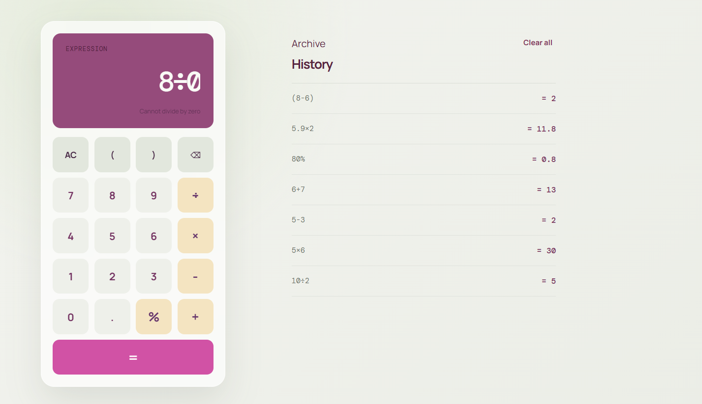

# Simple Calculator

A production-minded, full-stack calculator for everyday arithmetic. The client is a responsive React and TypeScript app; the lightweight Express API provides health checks and in-memory calculation history.

## Feature Overview

- Addition, subtraction, multiplication, and division
- Decimals, negative numbers, percentages, and parentheses
- Safe expression parsing with operator precedence, without JavaScript `eval()`
- Clear, backspace, and keyboard controls
- Validation for invalid operators, unbalanced brackets, and division by zero
- Calculation history with reusable entries and local-storage fallback
- Responsive desktop and mobile interface

## Installation

```bash
npm install
npm run dev
```

Open `http://localhost:5173`. The Vite client proxies `/api` requests to the Express server on port `3001`.

Run the automated checks:

```bash
npm run test
npm run build
```

For a production-style API process after building:

```bash
npm run dev:server
```

## Code Architecture

- `src/utils/calculator.ts`: pure tokenizer and recursive-descent expression parser. It implements precedence and postfix percentage handling without unsafe evaluation.
- `src/utils/calculator.test.ts`: Vitest coverage for arithmetic, precedence, decimals, unary minus, percentages, malformed inputs, brackets, and divide-by-zero.
- `src/components/Calculator.tsx`: calculator display, keypad, input validation, calculation state, and global keyboard listener.
- `src/components/History.tsx`: reusable history panel with selection and clearing controls.
- `src/App.tsx`: application layout, history state, local-storage fallback, and API synchronization.
- `server/index.ts`: Express endpoints for health and in-memory history storage.
- `src/App.css`: responsive visual system and calculator layout.

## Screenshots




*Desktop View with Calculation History*

## VS Code Setup

1. Open this folder in VS Code.
2. Open the integrated terminal with **Terminal > New Terminal**.
3. Run `npm install`.
4. Run `npm run dev`.
5. Use the browser URL shown by Vite.
6. Use `npm run test` for unit tests and `npm run build` for a production build check.
